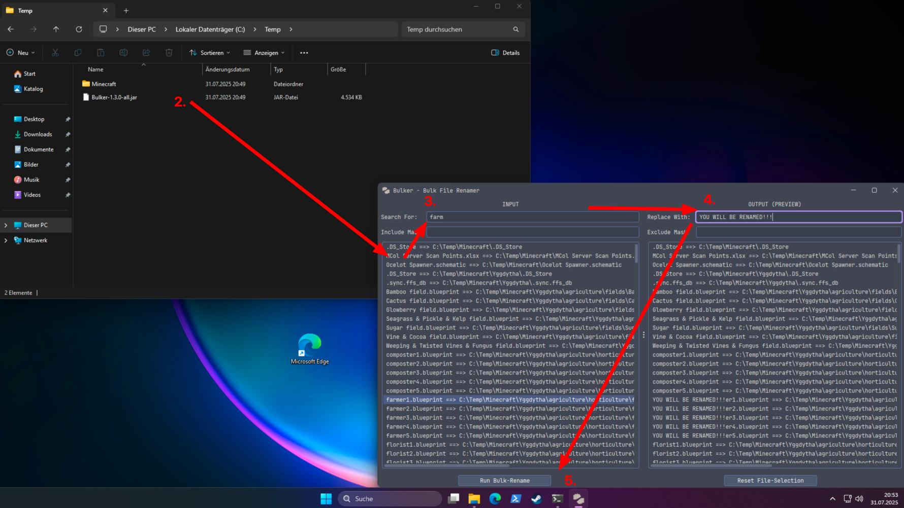

# Bulker

The bulk file-renamer.

Yes, files from directories are added recursively. Yes, all files from all contained directories of the dropped sources.
No Patrick, Mayonnaise is not an instrument.

## How-To-Use

1. Run the app using Java 21, `java -jar Bulker-1.0-SNAPSHOT-all.jar`
2. Drag-and-drop files and/or directories into the field on the left. All files from directories are added recursively.
3. Enter the search-text into `Search For` in the top left.
4. Enter the replacement-text into `Replace With` in the top right.
5. Hit the `Run Bulk-Rename`-button to rename all files which have your search-text in their name.

# Thanks

Special thanks to Davanum Srinivas, as without them the drag-and-drop list wouldn't exist:

https://www.codeproject.com/Articles/591/Drag-And-Drop-between-JList-and-Windows-Explorer