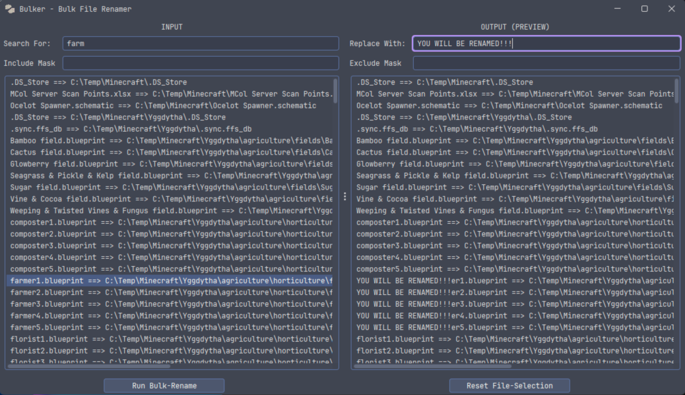

# Bulker

The bulk file-renamer.

Yes, files from directories are added recursively. Yes, all files from all contained directories of the dropped sources.
No Patrick, Mayonnaise is not an instrument.

Download the latest *Bulker-VERSION-all.jar* version from: https://github.com/Griefed/Bulker/releases/latest



## How-To-Use

### GUI

1. Run the app using Java 21, `java -jar Bulker-<VERSION>-all.jar` where `<VERSION>` is the version you downloaded
2. Drag-and-drop files and/or directories into the field on the left. All files from directories are added recursively.
3. Enter the search-text into `Search For` in the top left.
4. Enter the replacement-text into `Replace With` in the top right.
5. Hit the `Run Bulk-Rename`-button to rename all files which have your search-text in their name.

**Include Mask** and **Exclude Mask** are *Optional*. They are Regexpressions you can use to further fine-trim your renaming and can be left empty. 


### CLI

You can run Bulker from the commandline, too.

#### Arguments

There's three arguments you must use:

1. `--search`
2. `--replace`
3. `--input`
4. `--include-mask` (Optional)
5. `--exclude-mask` (Optional)

`--search` is the text you want to look for in filenames. The equivalent to `Search For` in the GUI. Only a single `--search` when running in CLI.

`--replace` is the text you want to replace the searched text *with*. The equivalent to `Replace With` in the GUI. Only a single `--replace` when running in CLI.

`--input` must be the path to a file or directory. Directories are checked recursively. You may specify as many `--input` as you like.

`--include-mask` is an *optional* Regex which acts as an additional filter for file to *INCLUDE*. If this Regex matches a file, it will be included in the rename-process. If you don't want to use it, ignore this argument.

`--exclude-mask` is an *optional* Regex which acts as an additional filter for files to *EXCLUDE*. If this Regex matches a file, it will be excluded from the rename-process. If you don't want to use it, ignore this argument.

Example output for some Minecraft-files:

`java -jar .\Bulker-1.2.0-all.jar  --search "g" --replace "###" --input "E:\Temp"`
That would rename all files in the Temp-dir which contain the letter *g*

```
Renamed the following files:
E:\Temp\Yggdytha\fundamentals\a###ricultureresidence1.blueprint
E:\Temp\Yggdytha\fundamentals\a###ricultureresidence2.blueprint
E:\Temp\Yggdytha\fundamentals\a###ricultureresidence3.blueprint
E:\Temp\Yggdytha\fundamentals\a###ricultureresidence4.blueprint
E:\Temp\Yggdytha\fundamentals\a###ricultureresidence5.blueprint
E:\Temp\Yggdytha\y######dytha.pn###
```

# Thanks

Special thanks to Davanum Srinivas, as without them the drag-and-drop list wouldn't exist:

https://www.codeproject.com/Articles/591/Drag-And-Drop-between-JList-and-Windows-Explorer